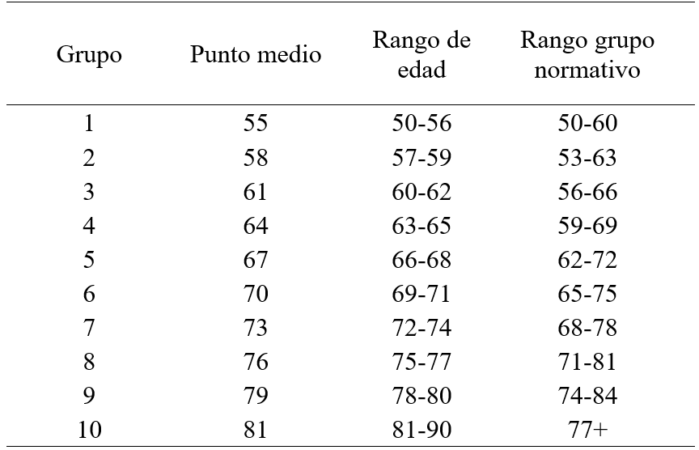
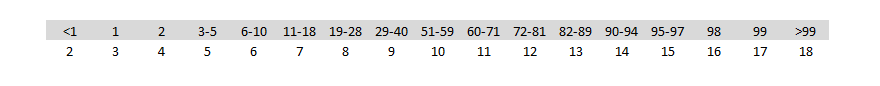

## INTRODUCIÓN

El objetivo de este documento es ilustrar el procedimiento para el cálculo de las puntuaciones estándar de la batería neuropsicológica Neuronorma Colombia, esto con la intención de brindar una mejor comprensión del mismo y así promover el análisis crítico y el uso clínico informado de esta herramienta.

Encontrará una explicación paso a paso que va desde las puntuaciones brutas de las pruebas hasta las puntuaciones escalares, no es necesario que comprenda el código que contiene este documento para entender este proceso.

El procedimiento de este documento se desarrolló en el software de libre acceso R por lo que, si desea simular el procedimiento o calcular puntuaciones escalares de sus propios datos, puede utilizar el este código con mínimas modificaciones, sin embargo, este puede mejorarse por lo que si tiene experiencia en el uso de R siéntase libre de modificarlo a su gusto. 

Finalmente, a continuación estan las referencias de las tesis de maestría que dieron lugar a la batería Neuronorma Colombia, en estas podrán encontrar una descripción detallada de todo el proceso, discusiones teóricas, así como los datos de todas las pruebas para el uso clínico:

- Duarte Pedroza, L. K. (2017). Lenguaje, Memoria y Habilidades Visuoconstructivas en el Envejecimiento Normal: Datos Normativos con la Batería Neuronorma Colombia (UNIVERSIDAD NACIONAL DE COLOMBIA). Recuperado de http://bdigital.unal.edu.co/56804/7/lilianakaterineduartepedroza.2017.pdf 

- Espitia Mendieta, A. D. (2017). Funciones ejecutivas en el envejecimiento normal: Datos normativos con la batería Neuronorma.Colombia (UNIVERSIDAD NACIONAL DE COLOMBIA). Recuperado de http://bdigital.unal.edu.co/56861/7/angiedayanaespitiamendieta.2017.pdf 

### Cargar paquetes 

El primer paso será cargar en R las librerias que utilizaremos
```{r, message = FALSE}
library(ggplot2)
library(sur)
library(dplyr)
library(readxl)
```

### Cargar base de datos

Asegúrese que la base de datos tenga las siguientes variables con los siguientes nombres:

Edad <- Edad del sujeto

Sexo <- Sexo del juteo, H = hombre, M = mujer

Escolaridad <- Número de años de estudio del sujeto

Variable <- Puntuaciones brutas de la prueba a estandarizar

En este ejemplo se carga la base de datos desde Excel, pero puede hacerlo de la forma que prefiera.  Asegúrese asignar el nombre base_puntuaciones a su base de datos para que el código corra sin mayores modificaciones, de la misma forma establezca el Working Directory según la ubicación de su archivo.
```{r}
setwd("C:/Users/asus/Desktop/Codido NeuroNorma")
base_puntuaciones <- read_excel("base_puntuaciones.xlsx")
```

### Maximización del tamaño de muestra

Con el fin de aumentar el número de participantes en cada uno de los grupos de comparación por edad se realiza la estrategia de solapamiento de intervalos. Así, se crean 10 grupos de edad desde los cuales se generan datos normativos tomando como referencia un punto medio de edad. El rango de edad alrededor de cada punto medio es de 10 años.

Por ejemplo, los datos normativos para una persona de 57 a 59 años se construye a partir de los datos de personas con una edad entre 53 y 63 años. La siguiente tabla resume los 10 grupos que conformaremos, su punto medio y el rango del grupo normativo.



```{r}

grupo_1 <- base_puntuaciones%>%
  select(Edad, Sexo, Escolaridad, Variable)%>%
  filter(Edad > 49 & Edad <= 60)

grupo_2 <- base_puntuaciones%>%
  select(Edad, Sexo, Escolaridad, Variable)%>%
  filter(Edad >= 53 & Edad <=63 )

grupo_3 <- base_puntuaciones%>%
  select(Edad, Sexo, Escolaridad, Variable)%>%
  filter(Edad >= 56 & Edad <= 66)

grupo_4 <- base_puntuaciones%>%
  select(Edad, Sexo, Escolaridad, Variable)%>%
  filter(Edad >= 59 & Edad <= 69)

grupo_5 <- base_puntuaciones%>%
  select(Edad, Sexo, Escolaridad, Variable)%>%
  filter(Edad >= 62 & Edad <= 72)

grupo_6 <- base_puntuaciones%>%
  select(Edad, Sexo, Escolaridad, Variable)%>%
  filter(Edad >=65 & Edad <= 75)

grupo_7 <- base_puntuaciones%>%
  select(Edad, Sexo, Escolaridad, Variable)%>%
  filter(Edad >=68 & Edad <= 78)

grupo_8 <- base_puntuaciones%>%
  select(Edad, Sexo, Escolaridad, Variable)%>%
  filter(Edad >= 71 & Edad <= 81)

grupo_9 <- base_puntuaciones%>%
  select(Edad, Sexo, Escolaridad, Variable)%>%
  filter(Edad >= 74 & Edad <= 84)

grupo_10 <- base_puntuaciones%>%
  select(Edad, Sexo, Escolaridad, Variable)%>%
  filter(Edad > 77)
```


### Tabla porcentajes acumulados

Una vez hemos conformados los 10 grupos de edad, creamos una tabla para cada grupo con las frecuencias y porcentajes acumulados de las  puntuaciones brutas por cada grupo de edad.

```{r}
tabla_grupo1<-cbind(Frec=data.frame(table(grupo_1$Variable)),
                    Acumu=cumsum(table(grupo_1$Variable)),
                    Porcen=cumulative.table(grupo_1$Variable))
tabla_grupo1<-rename(tabla_grupo1, Variable = Frec.Var1, 
                     Frecuencia=Frec.Freq)

tabla_grupo2<-cbind(Frec=data.frame(table(grupo_2$Variable)),
                    Acumu=cumsum(table(grupo_2$Variable)),
                    Porcen=cumulative.table(grupo_2$Variable))
tabla_grupo2<-rename(tabla_grupo2, Variable = Frec.Var1, 
                     Frecuencia=Frec.Freq)

tabla_grupo3<-cbind(Frec=data.frame(table(grupo_3$Variable)),
                    Acumu=cumsum(table(grupo_3$Variable)),
                    Porcen=cumulative.table(grupo_3$Variable))
tabla_grupo3<-rename(tabla_grupo3, Variable = Frec.Var1, 
                     Frecuencia=Frec.Freq)

tabla_grupo4<-cbind(Frec=data.frame(table(grupo_4$Variable)),
                    Acumu=cumsum(table(grupo_4$Variable)),
                    Porcen=cumulative.table(grupo_4$Variable))
tabla_grupo4<-rename(tabla_grupo4, Variable = Frec.Var1, 
                     Frecuencia=Frec.Freq)

tabla_grupo5<-cbind(Frec=data.frame(table(grupo_5$Variable)),
                    Acumu=cumsum(table(grupo_5$Variable)),
                    Porcen=cumulative.table(grupo_5$Variable))
tabla_grupo5<-rename(tabla_grupo5, Variable = Frec.Var1, 
                     Frecuencia=Frec.Freq)

tabla_grupo6<-cbind(Frec=data.frame(table(grupo_6$Variable)),
                    Acumu=cumsum(table(grupo_6$Variable)),
                    Porcen=cumulative.table(grupo_6$Variable))
tabla_grupo6<-rename(tabla_grupo6, Variable = Frec.Var1, 
                     Frecuencia=Frec.Freq)

tabla_grupo7<-cbind(Frec=data.frame(table(grupo_7$Variable)),
                    Acumu=cumsum(table(grupo_7$Variable)),
                    Porcen=cumulative.table(grupo_7$Variable))
tabla_grupo7<-rename(tabla_grupo7, Variable = Frec.Var1, 
                     Frecuencia=Frec.Freq)

tabla_grupo8<-cbind(Frec=data.frame(table(grupo_8$Variable)),
                    Acumu=cumsum(table(grupo_8$Variable)),
                    Porcen=cumulative.table(grupo_8$Variable))
tabla_grupo8<-rename(tabla_grupo8, Variable = Frec.Var1, 
                     Frecuencia=Frec.Freq)

tabla_grupo9<-cbind(Frec=data.frame(table(grupo_9$Variable)),
                    Acumu=cumsum(table(grupo_9$Variable)),
                    Porcen=cumulative.table(grupo_9$Variable))
tabla_grupo9<-rename(tabla_grupo9, Variable = Frec.Var1, 
                     Frecuencia=Frec.Freq)

tabla_grupo10<-cbind(Frec=data.frame(table(grupo_10$Variable)),
                     Acumu=cumsum(table(grupo_10$Variable)),
                     Porcen=cumulative.table(grupo_10$Variable))
tabla_grupo10<-rename(tabla_grupo10, Variable = Frec.Var1, 
                      Frecuencia=Frec.Freq)
```

Tendremos entonces para cada grupo de edad una tabla como la siguiente, note que la columna "Variable" contiene las puntuaciones brutas de la prueba neuropsicologica:
```{r}
knitr::kable(tabla_grupo1, format="markdown")

```

### Asignación de puntuaciones escalares 

Ahora asignamos las puntuaciones escalares a las puntuaciones naturales segun los percentiles. La asignación de percentiles permite la transformación de las mismas a puntuaciones escalares con media 10 y desviación estándar 3 y la obtención de las Normalized Standar Score for Age (NSSA).

La siguiente imagen ilustra que puntuación escalar corresponde a que percentil:


```{r}
tabla_grupo1<-tabla_grupo1%>%
  mutate(EscalarXEdad= case_when(Porcen < 1 ~ 2,
                                 Porcen > 1 & Porcen < 2 ~ 3,
                                 Porcen >= 2 & Porcen < 3 ~ 4,
                                 Porcen >= 3 & Porcen < 6 ~ 5,
                                 Porcen >= 6 & Porcen < 11 ~ 6,
                                 Porcen >= 11 & Porcen < 19 ~ 7,
                                 Porcen >= 19 & Porcen < 29 ~ 8,
                                 Porcen >= 29 & Porcen < 41 ~ 9,
                                 Porcen >= 41 & Porcen < 60 ~ 10,
                                 Porcen >= 60 & Porcen < 72 ~ 11,
                                 Porcen >= 72 & Porcen < 82 ~ 12,
                                 Porcen >= 82 & Porcen < 90 ~ 13,
                                 Porcen >= 90 & Porcen < 95 ~ 14,
                                 Porcen >= 95 & Porcen < 98 ~ 15,
                                 Porcen >= 98 & Porcen < 99 ~ 16,
                                 Porcen >= 99 & Porcen < 100 ~ 17,
                                 Porcen >= 100 ~ 18))

tabla_grupo2<-tabla_grupo2%>%
  mutate(EscalarXEdad= case_when(Porcen < 1 ~ 2,
                                 Porcen > 1 & Porcen < 2 ~ 3,
                                 Porcen >= 2 & Porcen < 3 ~ 4,
                                 Porcen >= 3 & Porcen < 6 ~ 5,
                                 Porcen >= 6 & Porcen < 11 ~ 6,
                                 Porcen >= 11 & Porcen < 19 ~ 7,
                                 Porcen >= 19 & Porcen < 29 ~ 8,
                                 Porcen >= 29 & Porcen < 41 ~ 9,
                                 Porcen >= 41 & Porcen < 60 ~ 10,
                                 Porcen >= 60 & Porcen < 72 ~ 11,
                                 Porcen >= 72 & Porcen < 82 ~ 12,
                                 Porcen >= 82 & Porcen < 90 ~ 13,
                                 Porcen >= 90 & Porcen < 95 ~ 14,
                                 Porcen >= 95 & Porcen < 98 ~ 15,
                                 Porcen >= 98 & Porcen < 99 ~ 16,
                                 Porcen >= 99 & Porcen < 100 ~ 17,
                                 Porcen >= 100 ~ 18))

tabla_grupo3<-tabla_grupo3%>%
  mutate(EscalarXEdad= case_when(Porcen < 1 ~ 2,
                                 Porcen > 1 & Porcen < 2 ~ 3,
                                 Porcen >= 2 & Porcen < 3 ~ 4,
                                 Porcen >= 3 & Porcen < 6 ~ 5,
                                 Porcen >= 6 & Porcen < 11 ~ 6,
                                 Porcen >= 11 & Porcen < 19 ~ 7,
                                 Porcen >= 19 & Porcen < 29 ~ 8,
                                 Porcen >= 29 & Porcen < 41 ~ 9,
                                 Porcen >= 41 & Porcen < 60 ~ 10,
                                 Porcen >= 60 & Porcen < 72 ~ 11,
                                 Porcen >= 72 & Porcen < 82 ~ 12,
                                 Porcen >= 82 & Porcen < 90 ~ 13,
                                 Porcen >= 90 & Porcen < 95 ~ 14,
                                 Porcen >= 95 & Porcen < 98 ~ 15,
                                 Porcen >= 98 & Porcen < 99 ~ 16,
                                 Porcen >= 99 & Porcen < 100 ~ 17,
                                 Porcen >= 100 ~ 18))

tabla_grupo4<-tabla_grupo4%>%
  mutate(EscalarXEdad= case_when(Porcen < 1 ~ 2,
                                 Porcen > 1 & Porcen < 2 ~ 3,
                                 Porcen >= 2 & Porcen < 3 ~ 4,
                                 Porcen >= 3 & Porcen < 6 ~ 5,
                                 Porcen >= 6 & Porcen < 11 ~ 6,
                                 Porcen >= 11 & Porcen < 19 ~ 7,
                                 Porcen >= 19 & Porcen < 29 ~ 8,
                                 Porcen >= 29 & Porcen < 41 ~ 9,
                                 Porcen >= 41 & Porcen < 60 ~ 10,
                                 Porcen >= 60 & Porcen < 72 ~ 11,
                                 Porcen >= 72 & Porcen < 82 ~ 12,
                                 Porcen >= 82 & Porcen < 90 ~ 13,
                                 Porcen >= 90 & Porcen < 95 ~ 14,
                                 Porcen >= 95 & Porcen < 98 ~ 15,
                                 Porcen >= 98 & Porcen < 99 ~ 16,
                                 Porcen >= 99 & Porcen < 100 ~ 17,
                                 Porcen >= 100 ~ 18))

tabla_grupo5<-tabla_grupo5%>%
  mutate(EscalarXEdad= case_when(Porcen < 1 ~ 2,
                                 Porcen > 1 & Porcen < 2 ~ 3,
                                 Porcen >= 2 & Porcen < 3 ~ 4,
                                 Porcen >= 3 & Porcen < 6 ~ 5,
                                 Porcen >= 6 & Porcen < 11 ~ 6,
                                 Porcen >= 11 & Porcen < 19 ~ 7,
                                 Porcen >= 19 & Porcen < 29 ~ 8,
                                 Porcen >= 29 & Porcen < 41 ~ 9,
                                 Porcen >= 41 & Porcen < 60 ~ 10,
                                 Porcen >= 60 & Porcen < 72 ~ 11,
                                 Porcen >= 72 & Porcen < 82 ~ 12,
                                 Porcen >= 82 & Porcen < 90 ~ 13,
                                 Porcen >= 90 & Porcen < 95 ~ 14,
                                 Porcen >= 95 & Porcen < 98 ~ 15,
                                 Porcen >= 98 & Porcen < 99 ~ 16,
                                 Porcen >= 99 & Porcen < 100 ~ 17,
                                 Porcen >= 100 ~ 18))

tabla_grupo6<-tabla_grupo6%>%
  mutate(EscalarXEdad= case_when(Porcen < 1 ~ 2,
                                 Porcen > 1 & Porcen < 2 ~ 3,
                                 Porcen >= 2 & Porcen < 3 ~ 4,
                                 Porcen >= 3 & Porcen < 6 ~ 5,
                                 Porcen >= 6 & Porcen < 11 ~ 6,
                                 Porcen >= 11 & Porcen < 19 ~ 7,
                                 Porcen >= 19 & Porcen < 29 ~ 8,
                                 Porcen >= 29 & Porcen < 41 ~ 9,
                                 Porcen >= 41 & Porcen < 60 ~ 10,
                                 Porcen >= 60 & Porcen < 72 ~ 11,
                                 Porcen >= 72 & Porcen < 82 ~ 12,
                                 Porcen >= 82 & Porcen < 90 ~ 13,
                                 Porcen >= 90 & Porcen < 95 ~ 14,
                                 Porcen >= 95 & Porcen < 98 ~ 15,
                                 Porcen >= 98 & Porcen < 99 ~ 16,
                                 Porcen >= 99 & Porcen < 100 ~ 17,
                                 Porcen >= 100 ~ 18))

tabla_grupo7<-tabla_grupo7%>%
  mutate(EscalarXEdad= case_when(Porcen < 1 ~ 2,
                                 Porcen > 1 & Porcen < 2 ~ 3,
                                 Porcen >= 2 & Porcen < 3 ~ 4,
                                 Porcen >= 3 & Porcen < 6 ~ 5,
                                 Porcen >= 6 & Porcen < 11 ~ 6,
                                 Porcen >= 11 & Porcen < 19 ~ 7,
                                 Porcen >= 19 & Porcen < 29 ~ 8,
                                 Porcen >= 29 & Porcen < 41 ~ 9,
                                 Porcen >= 41 & Porcen < 60 ~ 10,
                                 Porcen >= 60 & Porcen < 72 ~ 11,
                                 Porcen >= 72 & Porcen < 82 ~ 12,
                                 Porcen >= 82 & Porcen < 90 ~ 13,
                                 Porcen >= 90 & Porcen < 95 ~ 14,
                                 Porcen >= 95 & Porcen < 98 ~ 15,
                                 Porcen >= 98 & Porcen < 99 ~ 16,
                                 Porcen >= 99 & Porcen < 100 ~ 17,
                                 Porcen >= 100 ~ 18))

tabla_grupo8<-tabla_grupo8%>%
  mutate(EscalarXEdad= case_when(Porcen < 1 ~ 2,
                                 Porcen > 1 & Porcen < 2 ~ 3,
                                 Porcen >= 2 & Porcen < 3 ~ 4,
                                 Porcen >= 3 & Porcen < 6 ~ 5,
                                 Porcen >= 6 & Porcen < 11 ~ 6,
                                 Porcen >= 11 & Porcen < 19 ~ 7,
                                 Porcen >= 19 & Porcen < 29 ~ 8,
                                 Porcen >= 29 & Porcen < 41 ~ 9,
                                 Porcen >= 41 & Porcen < 60 ~ 10,
                                 Porcen >= 60 & Porcen < 72 ~ 11,
                                 Porcen >= 72 & Porcen < 82 ~ 12,
                                 Porcen >= 82 & Porcen < 90 ~ 13,
                                 Porcen >= 90 & Porcen < 95 ~ 14,
                                 Porcen >= 95 & Porcen < 98 ~ 15,
                                 Porcen >= 98 & Porcen < 99 ~ 16,
                                 Porcen >= 99 & Porcen < 100 ~ 17,
                                 Porcen >= 100 ~ 18))

tabla_grupo9<-tabla_grupo9%>%
  mutate(EscalarXEdad= case_when(Porcen < 1 ~ 2,
                                 Porcen > 1 & Porcen < 2 ~ 3,
                                 Porcen >= 2 & Porcen < 3 ~ 4,
                                 Porcen >= 3 & Porcen < 6 ~ 5,
                                 Porcen >= 6 & Porcen < 11 ~ 6,
                                 Porcen >= 11 & Porcen < 19 ~ 7,
                                 Porcen >= 19 & Porcen < 29 ~ 8,
                                 Porcen >= 29 & Porcen < 41 ~ 9,
                                 Porcen >= 41 & Porcen < 60 ~ 10,
                                 Porcen >= 60 & Porcen < 72 ~ 11,
                                 Porcen >= 72 & Porcen < 82 ~ 12,
                                 Porcen >= 82 & Porcen < 90 ~ 13,
                                 Porcen >= 90 & Porcen < 95 ~ 14,
                                 Porcen >= 95 & Porcen < 98 ~ 15,
                                 Porcen >= 98 & Porcen < 99 ~ 16,
                                 Porcen >= 99 & Porcen < 100 ~ 17,
                                 Porcen >= 100 ~ 18))

tabla_grupo10<-tabla_grupo10%>%
  mutate(EscalarXEdad= case_when(Porcen < 1 ~ 2,
                                 Porcen > 1 & Porcen < 2 ~ 3,
                                 Porcen >= 2 & Porcen < 3 ~ 4,
                                 Porcen >= 3 & Porcen < 6 ~ 5,
                                 Porcen >= 6 & Porcen < 11 ~ 6,
                                 Porcen >= 11 & Porcen < 19 ~ 7,
                                 Porcen >= 19 & Porcen < 29 ~ 8,
                                 Porcen >= 29 & Porcen < 41 ~ 9,
                                 Porcen >= 41 & Porcen < 60 ~ 10,
                                 Porcen >= 60 & Porcen < 72 ~ 11,
                                 Porcen >= 72 & Porcen < 82 ~ 12,
                                 Porcen >= 82 & Porcen < 90 ~ 13,
                                 Porcen >= 90 & Porcen < 95 ~ 14,
                                 Porcen >= 95 & Porcen < 98 ~ 15,
                                 Porcen >= 98 & Porcen < 99 ~ 16,
                                 Porcen >= 99 & Porcen < 100 ~ 17,
                                 Porcen >= 100 ~ 18))
```


El siguiente paso será asignar las puntuaciones escalares corregidas por edad, que acabamos de obtener, a cada sujeto de nuestra base de datos.

```{r}
Escalar_grupo1 <- merge(grupo_1, tabla_grupo1, by.x = "Variable")
EscalarXEdad_1<-Escalar_grupo1%>%
  select(Variable, Edad, Sexo, Escolaridad, EscalarXEdad)%>%
  filter(Edad > 49 & Edad <=56)

Escalar_grupo2 <- merge(grupo_2, tabla_grupo2, by.x = "Variable")
EscalarXEdad_2<-Escalar_grupo2%>%
  select(Variable, Edad, Sexo, Escolaridad, EscalarXEdad)%>%
  filter(Edad > 56 & Edad <=59)

Escalar_grupo3 <- merge(grupo_3, tabla_grupo3, by.x = "Variable")
EscalarXEdad_3<-Escalar_grupo3%>%
  select(Variable, Edad, Sexo, Escolaridad, EscalarXEdad)%>%
  filter(Edad > 59 & Edad <=62)

Escalar_grupo4 <- merge(grupo_4, tabla_grupo4, by.x = "Variable")
EscalarXEdad_4<-Escalar_grupo4%>%
  select(Variable, Edad, Sexo, Escolaridad, EscalarXEdad)%>%
  filter(Edad > 62 & Edad <=65)

Escalar_grupo5 <- merge(grupo_5, tabla_grupo5, by.x = "Variable")
EscalarXEdad_5<-Escalar_grupo5%>%
  select(Variable, Edad, Sexo, Escolaridad, EscalarXEdad)%>%
  filter(Edad > 65 & Edad <=68)

Escalar_grupo6 <- merge(grupo_6, tabla_grupo6, by.x = "Variable")
EscalarXEdad_6<-Escalar_grupo6%>%
  select(Variable, Edad, Sexo, Escolaridad, EscalarXEdad)%>%
  filter(Edad > 68 & Edad <=71)

Escalar_grupo7 <- merge(grupo_7, tabla_grupo7, by.x = "Variable")
EscalarXEdad_7<-Escalar_grupo7%>%
  select(Variable, Edad, Sexo, Escolaridad, EscalarXEdad)%>%
  filter(Edad > 71 & Edad <=74)

Escalar_grupo8 <- merge(grupo_8, tabla_grupo8, by.x = "Variable")
EscalarXEdad_8<-Escalar_grupo8%>%
  select(Variable, Edad, Sexo, Escolaridad, EscalarXEdad)%>%
  filter(Edad > 74 & Edad <=77)

Escalar_grupo9 <- merge(grupo_9, tabla_grupo9, by.x = "Variable")
EscalarXEdad_9<-Escalar_grupo9%>%
  select(Variable, Edad, Sexo, Escolaridad, EscalarXEdad)%>%
  filter(Edad > 77 & Edad <=80)

Escalar_grupo10 <- merge(grupo_10, tabla_grupo10, by.x = "Variable")
EscalarXEdad_10<-Escalar_grupo10%>%
  select(Variable, Edad, Sexo, Escolaridad, EscalarXEdad)%>%
  filter(Edad > 80 & Edad <=90)

EscalarXEdadTotal<-rbind(EscalarXEdad_1, EscalarXEdad_2,EscalarXEdad_3,
                         EscalarXEdad_4, EscalarXEdad_5, EscalarXEdad_6, 
                         EscalarXEdad_7, EscalarXEdad_8, EscalarXEdad_9,
                         EscalarXEdad_10)
```

### Normalización de las puntuaciones escales
En las siguientes gráficas podemos ver como el asignar puntuaciones escalares hace que la distribución de los datos adopte una forma  cercana a la distrubución normal, con una media cercana a 10 y una desviasion estandar cercana a 3. Esto nos permite tomar el escalar 6 como criterio de alteración (>1sd) ademas de tener todas las pruebas en la misma unidad de medida.

```{r}

ggplot(grupo_1, aes(x=Variable))+
  geom_histogram(binwidth =1)

ggplot(Escalar_grupo1, aes(x=EscalarXEdad))+
  geom_histogram(binwidth =1)

eje1<-Escalar_grupo1%>%
  select(EscalarXEdad)%>%
  summarise(mean(EscalarXEdad), sd(EscalarXEdad))

knitr::kable(eje1, format="markdown")
```


### Efecto de la escolaridad

En este punto se realiza una regresión simple para determinar si es necesario hacer correcciones por escolaridad o no. Los criterios para esto son que el R squared sea mayor a 0.05 (5% de varianza explicada) y la Beta significativa p<0.05. También graficamos la regresión para comprender mejor la relación entre las variables.

```{r message = FALSE}
ggplot(EscalarXEdadTotal, aes(x=Escolaridad, y= EscalarXEdad))+
  geom_point()+
  stat_smooth(method = lm)

regresion<-lm(EscalarXEdad~ Escolaridad, data = EscalarXEdadTotal)
summary(regresion)
```

### Normas sin efecto de escolaridad

Si no se cumplieron los criterios para realizar las correcciones por escolaridad entonces el proceso terminaría en este punto.
```{r}
normas_grupo1<- tabla_grupo1%>%
  select(Variable, Porcen, EscalarXEdad)

normas_grupo2<- tabla_grupo2%>%
  select(Variable, Porcen, EscalarXEdad)

normas_grupo3<- tabla_grupo3%>%
  select(Variable, Porcen, EscalarXEdad)

normas_grupo4<- tabla_grupo4%>%
  select(Variable, Porcen, EscalarXEdad)

normas_grupo5<- tabla_grupo5%>%
  select(Variable, Porcen, EscalarXEdad)

normas_grupo6<- tabla_grupo6%>%
  select(Variable, Porcen, EscalarXEdad)

normas_grupo7<- tabla_grupo7%>%
  select(Variable, Porcen, EscalarXEdad)

normas_grupo8<- tabla_grupo8%>%
  select(Variable, Porcen, EscalarXEdad)

normas_grupo9<- tabla_grupo9%>%
  select(Variable, Porcen, EscalarXEdad)

normas_grupo10<- tabla_grupo10%>%
  select(Variable, Porcen, EscalarXEdad)
```

Para cada grupo de edad entonces tendríamos una tabla como la que se presenta a continuación, en la que encontramos la puntuacion bruta, el porcentaje acumulado a la que está asociada y su puntuacion escalar correspondiente.


```{r}
knitr::kable(normas_grupo1, format="markdown")
```


### Corrección por escolaridad

Si se cumplieron con los criterios para realizar una corrección por escolaridad entonces continuamos.

Se construye la tabla que ajusta las puntuaciones por escolaridad. La ecuación utilizada para realizar las correcciones es la siguiente: NSS(A&E)=NSS(A)-(ß*[Educ-11]), donde “NSS(A&E)” equivale a la puntuación corregida por edad y escolaridad, “NSS(A)” equivale a la puntuación escalar obtenida al corregir las puntuaciones brutas al considerar su relación con la edad, el valor “ß” corresponde al ß no estandarizado resultante del modelo de regresión para cada prueba, “Educ” es el nivel educativo de cada participante, expresado en años, al cual se le resta la media de escolaridad de la muestra, que en este caso fue de 11.

```{r}
xbeta<-data.frame(t(regresion[["coefficients"]]))
beta<-as.vector(xbeta$Escolaridad)

Esc_edad_esc<- data.frame(EscXEdad= (2:18),
          Esco0= (2:18 - trunc(beta * (0 - 11))),
           Esco1= (2:18 - trunc(beta * (1 - 11))),
           Esco2= (2:18 - trunc(beta * (2 - 11))),
           Esco3= (2:18 - trunc(beta * (3 - 11))),
           Esco4= (2:18 - trunc(beta * (4 - 11))),
           Esco5= (2:18 - trunc(beta * (5 - 11))),
           Esco6= (2:18 - trunc(beta * (6 - 11))),
           Esco7= (2:18 - trunc(beta * (7 - 11))),
           Esco8= (2:18 - trunc(beta * (8 - 11))),
           Esco9= (2:18 - trunc(beta * (9 - 11))),
           Esco10= (2:18 - trunc(beta * (10 - 11))),
           Esco11= (2:18 - trunc(beta * (11- 11))),
           Esco12= (2:18 - trunc(beta * (12 - 11))),
           Esco13= (2:18 - trunc(beta * (13 - 11))),
           Esco14= (2:18 - trunc(beta * (14 - 11))),
           Esco15= (2:18 - trunc(beta * (15 - 11))),
           Esco16= (2:18 - trunc(beta * (16 - 11))),
           Esco17= (2:18 - trunc(beta * (17 - 11))),
           Esco18= (2:18 - trunc(beta * (18 - 11))))
```

De esta forma obtendremos una tabla como la siguiente:
```{r}
knitr::kable(Esc_edad_esc, format="html")

```
***

La primera columna nos muestra puntuación escalar ajustada por edad, las demás columnas nos muestran entonces que esclarar le corresponde a un sujeto dado un determinado nivel de escolaridad, que va de 0 años a 18 años.

De esta manera tendriamos las puntuaciones escalares correjidas por edad y escolaridad, solo tendriamos que exportar las tablas que hemos creado. Para el uso clínico práctico existe una unidad de trabajo la cual crea un perfil cognitivo del paciente a partir de las puntuaciones brutas en las pruebas  e información demografica como lo es la edad y la escolaridad.

***